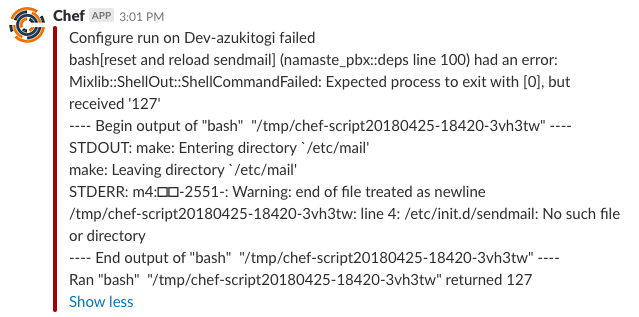

# awsopsworks-slack-handler

add your slack webhook URL into :webhook variable or create an attribute,

```
include_recipe 'awsopsworks-slack-handler::slack'
```

that will run the handler each time the a *configure* command will run


